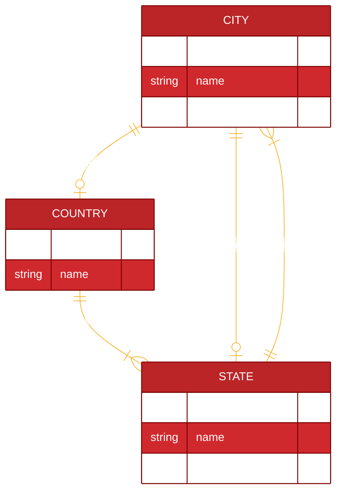

[[1.2.1 Виды нотаций]]
[[1.2.2 Связи]]

```mermaid
%%{ init: { 'theme': 'base', 'themeVariables': { 'primaryColor': '#BB2528', 'primaryTextColor': '#fff', 'primaryBorderColor': '#7C0000', 'lineColor': '#F8B229', 'secondaryColor': '#006100', 'tertiaryColor': '#fff' } } }%%

erDiagram
    CITY {
        int city_id PK
        string name
        string state_abbreviation FK
    }
    STATE {
        string state_abbreviation PK
        string name
        int country_id FK
    }
    COUNTRY {
        int country_id PK
        string name
    }
    COUNTRY ||--|{ STATE : "Has"
    STATE ||--|{ CITY : "Has"
    CITY ||--o| STATE : "Is capital of"
    CITY ||--o| COUNTRY : "Is capital of"
```
