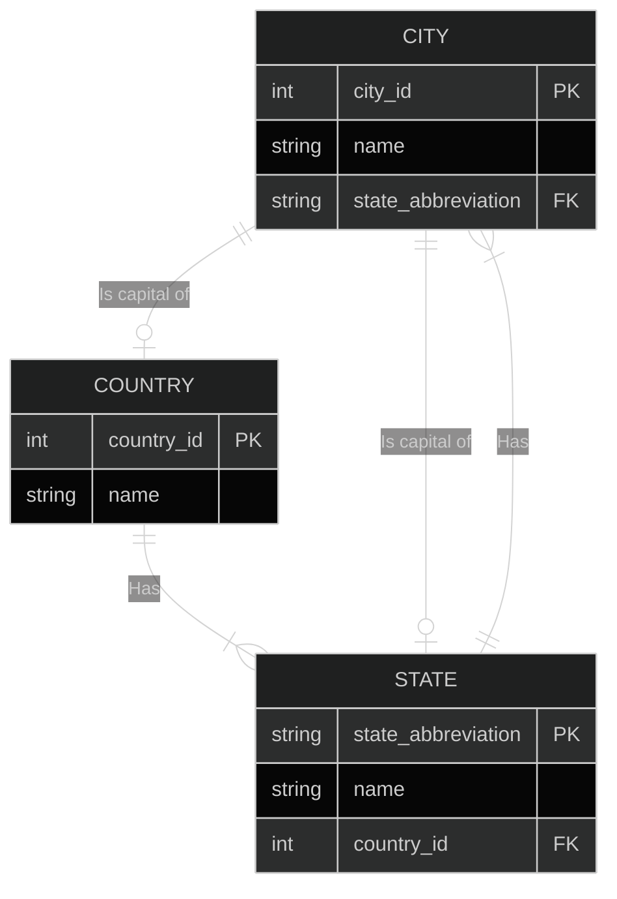

[[1.2.1 Виды нотаций]]
[[1.2.2 Связи]]

https://app.quickdatabasediagrams.com/#/

```mermaid
%%{init:{'theme':'dark'}}%%

erDiagram
    CITY {
        int city_id PK
        string name
        string state_abbreviation FK
    }
    STATE {
        string state_abbreviation PK
        string name
        int country_id FK
    }
    COUNTRY {
        int country_id PK
        string name
    }
    COUNTRY ||--|{ STATE : "Has"
    STATE ||--|{ CITY : "Has"
    CITY ||--o| STATE : "Is capital of"
    CITY ||--o| COUNTRY : "Is capital of"
```

![[../../_Resours/Pasted image 20241115140301.png]]