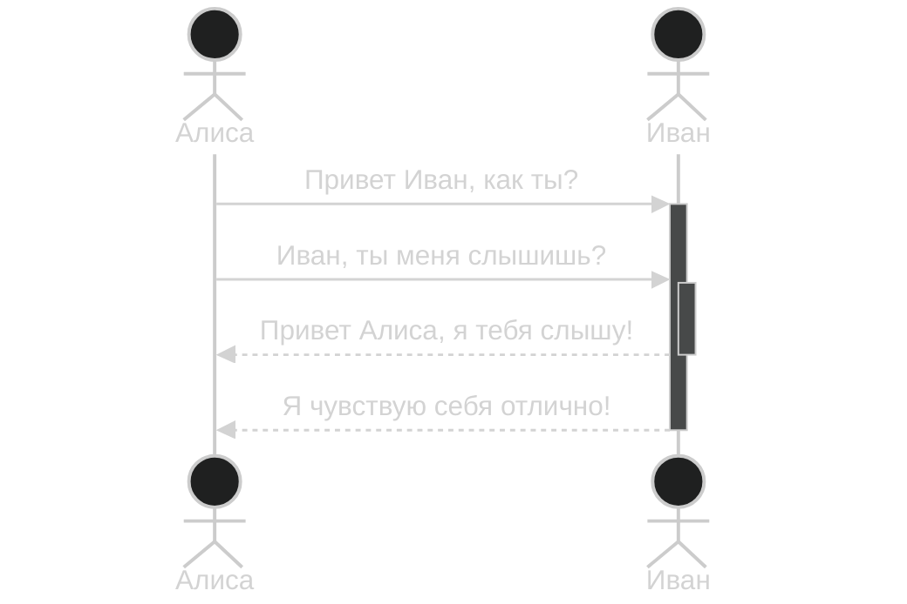

https://habr.com/ru/articles/814769/

**Объекты** — это сущности, которые взаимодействуют друг с другом. Например, пользователь, топик или очередь, микросервис. Помимо названия, объекты могут еще отличаться своим типом:

Типы объектов

**Линии жизни** (lifelines) отображают течение времени, а также активность или исполнение определенных функций объекта. Представляют из себя вертикальную линию с блоком активности.

**Сообщения** (messages) показывают обмен информацией между объектами. Например, клик пользователя на кнопку, но чаще это запрос или ответ, вызов хранимой процедуры или отправка сообщения. Сообщения отображаются в виде стрелок, направленных от одной линии жизни к другой, и бывают нескольких типов:

