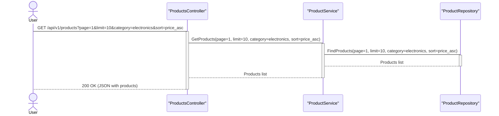

# Эндпоинты

**Эндпоинт (в переводе с англ. — конечная точка) — это шлюз, который соединяет серверные процессы приложения с внешним интерфейсом**. Простыми словами, это адрес, на который отправляются сообщения. 

Эндпоинты работают вместе с методами API. Это определённые URL-адреса, которые приложение использует для связи со сторонними службами и своими пользователями.

**Примеры эндпоинтов**:

- **В веб-API**. URL-адрес, через который приложение отправляет запрос и получает необходимые данные в формате JSON или XML. 
- **В электронной коммерции**. При оформлении заказа приложение может использовать различные точки для проверки наличия товара, расчёта стоимости доставки и обработки платежей.
- **В социальных сетях**. Через них внешние разработчики могут интегрироваться с социальной сетью, например, создавать и публиковать посты, загружать фотографии или получать статистику.

# HTTP

- `GET`. С помощью него клиент запрашивает у сервера содержимое ресурса. Например, HTML-страницу. Кроме того, с помощью этого метода на сервер можно передать данные клиента. Для этого в адресе ресурса после символа `?` необходимо добавить параметры и их значения, которые нужно передать на сервер. Данные, передаваемые в HTTP-запросе, выглядят следующим образом:


```http
https://qwerty.com/api/v1/books_**_?author=Orwell&title=1984
```


- `POST`. С помощью этого метода клиент может передать данные в теле сообщения, например, в случаях, когда данные нельзя передать с помощью метода `GET`. Это может быть пост в соцсети или данные банковской карты, которую нежелательно оставить в истории поиска. Также `POST` является неидемпотентным методом: при его отправке результат может отличаться. Ещё одна особенность `POST` — ответы на него не будут кэшироваться.
- `PUT`. Этот метод создаёт новый ресурс или заменяет существующий данными, которые указаны в теле запроса.
- `PATCH`. Работает таким же образом, как и `PUT`, только по отношению к части ресурса.
- `DELETE`. Клиент сообщает о том, что хотел бы удалить некий ресурс.
- `HEAD`. Это метод для получения заголовков ресурса. Часто его применяют для получения метаданных и проверки того, менялся ли ресурс с момента последнего посещения и существует ли он. 
- `OPTIONS`. С помощью него можно запросить список методов, которые он или его ресурс поддерживает. Также `OPTIONS` можно использовать для того, чтобы «пропинговать» сервер — протестировать его работоспособность.
- `TRACE`. С помощью него можно проверить, изменяют ли промежуточные узлы в сети запрос клиента.
- `CONNECT`. Запускает туннель между клиентом и сервером.


| Характеристика       | GET              | POST            |
| -------------------- | ---------------- | --------------- |
| Цель                 | Получение данных | Отправка данных |
| Передача данных      | В URL            | В теле запроса  |
| Видимость данных     | Видна            | Скрыта          |
| Кэширование          | Да               | Нет             |
| Идеология            | Безопасный       | Небезопасный    |
| Изменения на сервере | Нет              | Да              |
| Размер данных        | Ограничен        | Нет ограничений |

| Характеристика | POST                                                          | PUT                                                |
| -------------- | ------------------------------------------------------------- | -------------------------------------------------- |
| Цель           | Создать новый ресурс                                          | Обновить существующий ресурс                       |
| Идеология      | Создать                                                       | Заменить                                           |
| Идентификатор  | Не нужен                                                      | Необходим                                          |
| Уникальность   | Не гарантирует                                                | Гарантирует                                        |
| Примеры        | Создание нового поста, добавление комментария, загрузка файла | Изменение профиля, обновление товара, замена файла |

|Характеристика|PUT|PATCH|
|---|---|---|
|Идеология|Заменить весь ресурс|Частично обновить ресурс|
|Изменения|Все поля|Только указанные поля|
|Идентификатор|Необходим|Необходим|
|Идемпотентность|Да|Нет|
|Примеры|Обновление всех данных пользователя, замена файла целиком|Изменение имени пользователя, добавление нового тега к файлу|


## ❯ Список HTTP-кодов состояния

| **Код** | **Статус**                      | **Описание**                                                                                                                                                                                                                                           |
| ------- | ------------------------------- | ------------------------------------------------------------------------------------------------------------------------------------------------------------------------------------------------------------------------------------------------------ |
| 100     | Continue                        | Промежуточный ответ, указывающий, что начальная часть запроса принята и клиент может продолжать отправку.                                                                                                                                              |
| 101     | Switching Protocols             | Сервер сменил версию протокола по просьбе клиента.                                                                                                                                                                                                     |
| 102     | Processing                      | Так сервер сообщает клиенту, что принял запрос, но всё ещё обрабатывает его. Необходим для того, чтобы соединение не прекратилось из-за превышения времени ожидания. Этот код состояния используется в WebDAV — наборе расширений и дополнений к HTTP. |
| 103     | Early Hints                     | Код используется для возврата части заголовков, когда полный список не может быть быстро сформирован.                                                                                                                                                  |
| 200     | OK                              | Запрос успешно обработан.                                                                                                                                                                                                                              |
| 201     | Created                         | Запрос успешно выполнен, и в результате обработки появился новый ресурс.                                                                                                                                                                               |
| 202     | Accepted                        | Сервер принял запрос, но пока что ещё не обработал его.                                                                                                                                                                                                |
| 203     | Non-Authoritative Information   | Сервер взял информацию для ответа не из первоисточника. Например, резервной копии.                                                                                                                                                                     |
| 204     | No Content                      | В ответе нет тела сообщения.                                                                                                                                                                                                                           |
| 205     | Reset Content                   | Сервер сообщает клиенту, что тот должен сбросить введённые данные.                                                                                                                                                                                     |
| 206     | Partial Content                 | Используется, если клиент запросил только фрагмент ресурса.                                                                                                                                                                                            |
| 207     | Multi-Status                    | Сервер передаёт в ответе результаты выполнения сразу нескольких операций. Используется в WebDAV.                                                                                                                                                       |
| 208     | Already Reported                | Используется в WebDAV и означает, что часть сообщения есть в предыдущем ответе.                                                                                                                                                                        |
| 226     | IM Used                         | Сервер успешно обработал заголовок запроса A-IM. Используется для дельта-кодирования.                                                                                                                                                                  |
| 300     | Multiple Choices                | Сервер может предоставить ресурс в разных форматах MIME.                                                                                                                                                                                               |
| 301     | Moved Permanently               | Запрашиваемый ресурс переместили в другую директорию навсегда — её можно будет найти в заголовке Location.                                                                                                                                             |
| 302     | Found                           | Запрашиваемый ресурс в текущий момент временно размещён на другом адресе — его можно будет найти в заголовке Location.                                                                                                                                 |
| 303     | See Other                       | Ответ на запрос можно найти по другому URI с помощью `GET`.                                                                                                                                                                                            |
| 304     | Not Modified                    | Используется, если клиент запрашивал ресурс с заголовками `If-Modified-Since` или `If-None-Match`.                                                                                                                                                     |
| 305     | Use Proxy                       | Запрашиваемый ресурс доступен только через прокси.                                                                                                                                                                                                     |
| 307     | Temporary Redirect              | Запрашиваемый ресурс временно перемещен на другой URI. Для обращения к нему клиент должен использовать тот же метод, что и в первоначальном запросе.                                                                                                   |
| 308     | Permanent Redirect              | Запрашиваемый ресурс был навсегда перемещен на другой URI. Для обращения к нему клиент должен использовать тот же метод, что и в первоначальном запросе.                                                                                               |
| 400     | Bad Request                     | Клиент составил своё HTTP-сообщение неправильно.                                                                                                                                                                                                       |
| 401     | Unauthorized                    | Чтобы получить доступ к ресурсу, клиент должен пройти аутентификацию.                                                                                                                                                                                  |
| 402     | Payment Required                | Предусмотрен для будущего использования.                                                                                                                                                                                                               |
| 403     | Forbidden                       | У клиента нет необходимых прав доступа                                                                                                                                                                                                                 |
| 404     | Not Found                       | К сожалению, на данном адресе сервер ничего не нашёл. Скорее всего, клиент ошибся с URI или страница была удалена.                                                                                                                                     |
| 405     | Method Not Allowed              | Сервер не поддерживает тот метод запроса, что выбрал клиент.                                                                                                                                                                                           |
| 406     | Not Acceptable                  | Сервер вернёт такой код, если он или запрашиваемый ресурс не поддерживает заголовки запроса.                                                                                                                                                           |
| 407     | Proxy Authentication Required   | Клиент должен пройти аутентификацию на прокси-сервере.                                                                                                                                                                                                 |
| 408     | Request Timeout                 | Клиент не передал информацию серверу в определенный срок.                                                                                                                                                                                              |
| 409     | Conflict                        | Запрос не может быть выполнен из-за конфликта с другими запросами. Например, когда несколько пользователей пытаются обновить или изменить ресурс.                                                                                                      |
| 410     | Gone                            | Означает, что ресурс удалён или недоступен.                                                                                                                                                                                                            |
| 411     | Length Required                 | Клиент должен указать размер тела сообщения.                                                                                                                                                                                                           |
| 412     | Precondition Failed             | Сервер вернёт такой код состояния, если ни один из условных заголовков запроса не выполняется.                                                                                                                                                         |
| 413     | Payload Too Large               | Тело запроса слишком велико.                                                                                                                                                                                                                           |
| 414     | URI Too Long                    | URI слишком длинный. Такая ситуация может возникнуть, когда клиент пытается передать большое количество параметров через метод GET.                                                                                                                    |
| 415     | Unsupported Media Type          | Сервер не работает с указанным типом данных.                                                                                                                                                                                                           |
| 416     | Range Not Satisfiable           | Range вышел за пределы ресурса.                                                                                                                                                                                                                        |
| 417     | Expectation Failed              | Сервер не смог удовлетворить условия, описанные в заголовке запроса Expect.                                                                                                                                                                            |
| 418     | I'm a teapot                    | Шутливый код, введенный в протоколе HTCPCP.                                                                                                                                                                                                            |
| 421     | Misdirected Request             | Запрос был перенаправлен на другой сервер, который не смог его осуществить.                                                                                                                                                                            |
| 422     | Unprocessable Entity            | В запросе есть логическая ошибка. Используется в WebDAV.                                                                                                                                                                                               |
| 423     | Locked                          | Ресурс, к которому делается запрос, был заблокирован из-за используемого метода. Используется в WebDAV.                                                                                                                                                |
| 424     | Failed Dependency               | Запрос не выполнен, так как он зависел от другого запроса, который также не был обработан. Используется в WebDAV.                                                                                                                                      |
| 425     | Too Early                       | Сервер не готов обрабатывать запрос.                                                                                                                                                                                                                   |
| 426     | Upgrade Required                | Клиент должен обновить версию протокола для выполнения запроса.                                                                                                                                                                                        |
| 428     | Precondition Required           | Клиент должен использовать заголовки с условиями.                                                                                                                                                                                                      |
| 429     | Too Many Requests               | Клиент отправил слишком много запросов за короткий промежуток времени.                                                                                                                                                                                 |
| 431     | Request Header Fields Too Large | Сервер отказывается обрабатывать запрос, потому что поле с заголовками слишком большое.                                                                                                                                                                |
| 451     | Unavailable For Legal Reasons   | Этот код означает, что ресурс недоступен на юридическим причинам. Например, его заблокировали по требования государственных органов.                                                                                                                   |
| 500     | Internal Server Error           | Внутренняя ошибка сервера.                                                                                                                                                                                                                             |
| 501     | Not Implemented                 | Сервер не может выполнить запрос, потому что не поддерживает необходимые для этого возможности.                                                                                                                                                        |
| 502     | Bad Gateway                     | Если сервер — прокси или промежуточный шлюз, он отправит такой код в том случае, когда следующий узел возвращает ошибку.                                                                                                                               |
| 503     | Service Unavailable             | Сейчас сервер не может обработать запрос по техническим причинам.                                                                                                                                                                                      |
| 504     | Gateway Timeout                 | Если сервер — прокси или промежуточный шлюз, он отправит такой код в том случае, когда следующий узел не ответил за отведённое время.                                                                                                                  |
| 505     | HTTP Version Not Supported      | Сервер не поддерживает выбранную версию протокола.                                                                                                                                                                                                     |
| 506     | Variant Also Negotiates         | Внутренняя конфигурация сервера привела к цикличности.                                                                                                                                                                                                 |
| 507     | Insufficient Storage            | Серверу не хватает места для выполнения запроса. Используется в WebDAV.                                                                                                                                                                                |
| 508     | Loop Detected                   | При обработке запроса возник бесконечный цикл.                                                                                                                                                                                                         |
| 510     | Not Extended                    | На сервере нет расширения, которое хочет использовать клиент.                                                                                                                                                                                          |
| 511     | Network Authentication Required | Код, который использует провайдер сети для того, чтобы сообщить о необходимости авторизоваться в ней.                                                                                                                                                  |

# GET запрос

**Название метода:** Получение списка товаров

**Метод:** GET

**URL:** /api/v1/products

**Параметры запроса:**

- **page:** (Необязательный) Номер страницы для пагинации (по умолчанию 1).
- **limit:** (Необязательный) Количество товаров на странице (по умолчанию 10).
- **category:** (Необязательный) Идентификатор категории товаров (например, “electronics”).
- **sort:** (Необязательный) Сортировка товаров (например, “price”, “name”). Возможные значения: “price_asc”, “price_desc”, “name_asc”, “name_desc”.

**Заголовки запроса:**

- **Authorization:** Токен авторизации (необязательный).

**Ответ:**

**Статус код:**

- **200 OK:** Запрос успешно выполнен.
- **400 Bad Request:** Некорректный запрос.
- **401 Unauthorized:** Не авторизован.
- **403 Forbidden:** Нет доступа.
- **500 Internal Server Error:** Ошибка сервера.

**Тело ответа:**

- **JSON:**

```json
{
  "products": [
    {
      "id": 1,
      "name": "Товар 1",
      "price": 100,
      "category": "electronics",
      "description": "Описание товара 1"
    },
    {
      "id": 2,
      "name": "Товар 2",
      "price": 200,
      "category": "clothing",
      "description": "Описание товара 2"
    }
  ],
  "pagination": {
    "currentPage": 1,
    "totalPages": 5,
    "totalItems": 45
  }
}
```



**Описание диаграммы:**

- **Актор “User”** - это пользователь, который отправляет GET запрос.
- **“API Gateway”** - это слой, обрабатывающий входящие запросы.
- **“ProductsController”** - контроллер, который обрабатывает запрос и взаимодействует с сервисом.
- **“ProductService”** - сервис, отвечающий за логику работы с товарами.
- **“ProductRepository”** - репозиторий, который взаимодействует с базой данных для получения списка товаров.

# POST запрос

## Пример описания POST запроса в техническом задании

**Название метода:** Создание нового пользователя

**Метод:** POST

**URL:** /api/v1/users

**Тело запроса:**

```json
{
  "username": "john.doe",
  "email": "john.doe@example.com",
  "password": "secret123"
}
```

**Параметры запроса:**

- **Не используются**

**Заголовки запроса:**

- **Authorization:** Токен авторизации (необязательный).

**Ответ:**

**Статус код:**

- **201 Created:** Пользователь успешно создан.
- **400 Bad Request:** Некорректные данные в запросе.
- **401 Unauthorized:** Не авторизован.
- **403 Forbidden:** Нет доступа.
- **500 Internal Server Error:** Ошибка сервера.

**Тело ответа:**

- **JSON:**

```json
{
  "id": 123,
  "username": "john.doe",
  "email": "john.doe@example.com"
}
```

**Описание:**

Этот POST запрос используется для создания нового пользователя. Тело запроса содержит информацию о новом пользователе, включая имя пользователя, email и пароль.

**Дополнительные замечания:**

- Этот пример может быть адаптирован для конкретного проекта.
- В некоторых случаях может быть необходимо добавить дополнительные поля в тело запроса, например, имя, фамилию, адрес и т.д.
- Необходимо описать правила валидации данных в запросе, например, проверку формата email, длины пароля и т.д.
- Важно описать все возможные варианты ответа, включая ошибки.
- Рекомендуется использовать инструменты для тестирования API для проверки корректности запроса и ответа.