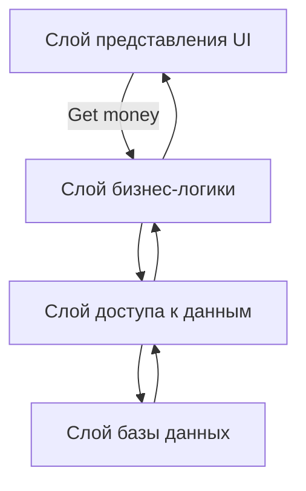

### Монолит

Монолитная архитектура - это архитектурный стиль, где все компоненты приложения объединены в единый код, который развертывается как одно целое. Это классический подход к разработке программного обеспечения, который использовался до появления микросервисов.

**Характеристики монолитной архитектуры:**

- **Единый код:** Все функциональные модули приложения объединены в одном кодовом репозитории.
- **Централизованная база данных:** Обычно используется единая база данных для всех компонентов приложения.
- **Единое развертывание:** Все приложение развертывается как единый пакет.
- **Тесная связь:** Компоненты приложения тесно связаны друг с другом.

**Преимущества монолитной архитектуры:**

- **Простота разработки:** Легко разрабатывать и отлаживать, так как все компоненты находятся в одном месте.
- **Простая отладка:** Отладка проблем проще, так как все компоненты доступны в одном коде.
- **Меньше ресурсов:** Требуется меньше ресурсов для разработки и развертывания.
- **Оптимизация производительности:** Компоненты могут взаимодействовать друг с другом быстрее, так как они находятся в одном процессе.

**Недостатки монолитной архитектуры:**

- **Сложность модификации:** Изменение одного компонента может потребовать перекомпиляции и повторного развертывания всего приложения.
- **Сложность масштабирования:** Невозможно масштабировать отдельные компоненты приложения.
- **Уязвимость:** Ошибка в одном компоненте может нарушить работу всего приложения.
- **Замедленный цикл разработки:** Новые функции могут быть сложными для добавления, так как требуется изменять весь код.
- **Технологическая ограниченность:** Все приложение должно использовать одну технологию.

**Примеры использования монолитной архитектуры:**

- **Простые приложения:** Небольшие веб-сайты, приложения для настольных компьютеров.
- **Старые приложения:** Многие существующие приложения, особенно те, которые были разработаны до появления микросервисов.

**Когда подходит монолитная архитектура:**

- **Простые приложения:** Для небольших приложений с ограниченной функциональностью.
- **Стартапы:** Для быстрой разработки и развертывания продукта.
- **Небольшие команды:** Для небольших команд разработчиков, которые могут легко управлять единым кодом.

**Когда не подходит монолитная архитектура:**

- **Сложные приложения:** Для больших приложений с множеством функциональных модулей.
- **Высокие требования к масштабируемости:** Если приложение должно быть масштабируемым для обработки большого количества запросов.
- **Независимая разработка:** Если требуется независимая работа разных команд над разными частями приложения.

**Монолитная архитектура - это простой и эффективный подход для небольших приложений, но для крупных и сложных систем микросервисная архитектура может быть более подходящим вариантом.**

### Бессервисная

Бессервисная архитектура (Serverless)

**Бессервисная архитектура** - это архитектурный стиль, где разработчики фокусируются исключительно на написании кода для своей бизнес-логики, не задумываясь о управлении серверами, инфраструктурой и масштабированием. Вместо этого они используют “бессерверные” платформы, которые автоматически управляют всеми этими аспектами.

**Ключевые особенности бессервисной архитектуры:**

- **Функции (Functions):** Приложения разбиваются на небольшие, независимые функции, которые выполняются по запросу.
- **Автоматическое масштабирование:** Платформа автоматически масштабирует ресурсы в соответствии с нагрузкой на приложение.
- **Управление ресурсами:** Платформа управляет серверами, базами данных, сетевыми ресурсами и другими инфраструктурными компонентами.
- **Платите только за использование:** Оплата происходит только за фактическое время выполнения функций.
- **Фокус на коде:** Разработчики могут сосредоточиться на создании бизнес-логики, не тратя время на настройку и управление инфраструктурой.

**Примеры бессерверных платформ:**

- **AWS Lambda:** Платформа бессерверных вычислений от Amazon.
- **OpenAI Cloud Functions:** Платформа бессерверных вычислений от Google.
- **Azure Functions:** Платформа бессерверных вычислений от Microsoft.
- **Netlify:** Платформа для размещения веб-приложений с бессерверными функциями.
- **Vercel:** Платформа для размещения веб-приложений с бессерверными функциями.

**Преимущества бессервисной архитектуры:**

- **Снижение затрат:** Оплата только за фактическое использование, что снижает затраты на инфраструктуру.
- **Повышенная масштабируемость:** Автоматическое масштабирование позволяет легко обрабатывать пиковые нагрузки.
- **Упрощение разработки:** Разработчики могут сосредоточиться на написании кода, не беспокоясь об инфраструктуре.
- **Быстрое развертывание:** Функции можно развернуть очень быстро, что ускоряет процесс разработки.
- **Улучшенная надежность:** Платформа управляет надежностью и доступностью функций.

**Недостатки бессервисной архитектуры:**

- **Зависимость от платформы:** Приложение зависит от выбранной бессерверной платформы.
- **Ограничения:** Функции могут иметь ограничение по времени выполнения и использованию ресурсов.
- **Сложности отладки:** Отладка проблем может быть сложной из-за отсутствия прямого доступа к серверам.
- **“Холодный старт”:** Первое выполнение функции может быть медленным, так как ей нужно время для запуска.
- **Безопасность:** Необходимо тщательно управлять безопасностью функций, так как они выполняются в среде, управляемой платформой.

**Когда подходит бессервисная архитектура:**

- **Частые изменения:** Для приложений, которые часто обновляются и меняются.
- **Непредсказуемая нагрузка:** Для приложений, которые испытывают пиковые нагрузки.
- **Небольшие приложения:** Для небольших, автономных функций, таких как обработка событий, интеграции API и т.д.
- **Быстрая разработка:** Для ускорения процесса разработки и развертывания.

**Когда не подходит бессервисная архитектура:**

- **Приложения с высокими требованиями к производительности:** Для приложений, где требуется высокая производительность и низкая задержка.
- **Приложения с длительным временем выполнения:** Для приложений, где функции работают в течение длительного времени.
- **Приложения с строгими требованиями к безопасности:** Для приложений, где требуется полный контроль над безопасностью.

**Бессервисная архитектура - это относительно новый подход к разработке, который быстро набирает популярность. Она предлагает ряд преимуществ, но также имеет свои ограничения. Важно тщательно взвесить преимущества и недостатки бессервисной архитектуры, прежде чем использовать ее для своих проектов.**

https://habr.com/ru/companies/alconost/articles/522662/