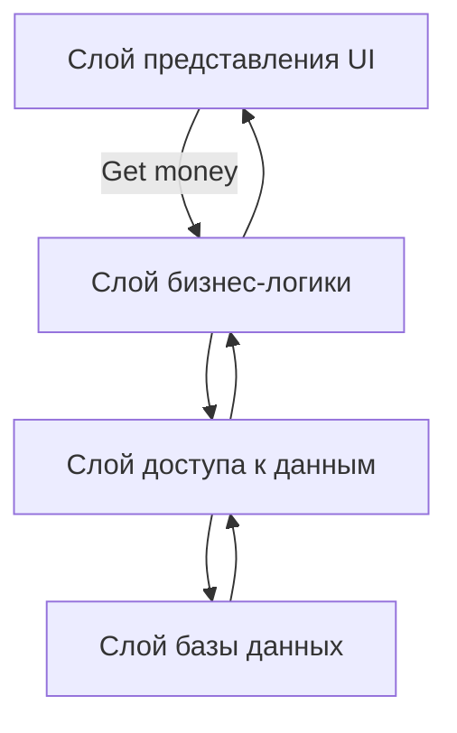

### Монолит

Монолитная архитектура - это архитектурный стиль, где все компоненты приложения объединены в единый код, который развертывается как одно целое. Это классический подход к разработке программного обеспечения, который использовался до появления микросервисов.

**Характеристики монолитной архитектуры:**

- **Единый код:** Все функциональные модули приложения объединены в одном кодовом репозитории.
- **Централизованная база данных:** Обычно используется единая база данных для всех компонентов приложения.
- **Единое развертывание:** Все приложение развертывается как единый пакет.
- **Тесная связь:** Компоненты приложения тесно связаны друг с другом.

**Преимущества монолитной архитектуры:**

- **Простота разработки:** Легко разрабатывать и отлаживать, так как все компоненты находятся в одном месте.
- **Простая отладка:** Отладка проблем проще, так как все компоненты доступны в одном коде.
- **Меньше ресурсов:** Требуется меньше ресурсов для разработки и развертывания.
- **Оптимизация производительности:** Компоненты могут взаимодействовать друг с другом быстрее, так как они находятся в одном процессе.

**Недостатки монолитной архитектуры:**

- **Сложность модификации:** Изменение одного компонента может потребовать перекомпиляции и повторного развертывания всего приложения.
- **Сложность масштабирования:** Невозможно масштабировать отдельные компоненты приложения.
- **Уязвимость:** Ошибка в одном компоненте может нарушить работу всего приложения.
- **Замедленный цикл разработки:** Новые функции могут быть сложными для добавления, так как требуется изменять весь код.
- **Технологическая ограниченность:** Все приложение должно использовать одну технологию.

**Примеры использования монолитной архитектуры:**

- **Простые приложения:** Небольшие веб-сайты, приложения для настольных компьютеров.
- **Старые приложения:** Многие существующие приложения, особенно те, которые были разработаны до появления микросервисов.

**Когда подходит монолитная архитектура:**

- **Простые приложения:** Для небольших приложений с ограниченной функциональностью.
- **Стартапы:** Для быстрой разработки и развертывания продукта.
- **Небольшие команды:** Для небольших команд разработчиков, которые могут легко управлять единым кодом.

**Когда не подходит монолитная архитектура:**

- **Сложные приложения:** Для больших приложений с множеством функциональных модулей.
- **Высокие требования к масштабируемости:** Если приложение должно быть масштабируемым для обработки большого количества запросов.
- **Независимая разработка:** Если требуется независимая работа разных команд над разными частями приложения.

**Монолитная архитектура - это простой и эффективный подход для небольших приложений, но для крупных и сложных систем микросервисная архитектура может быть более подходящим вариантом.**

